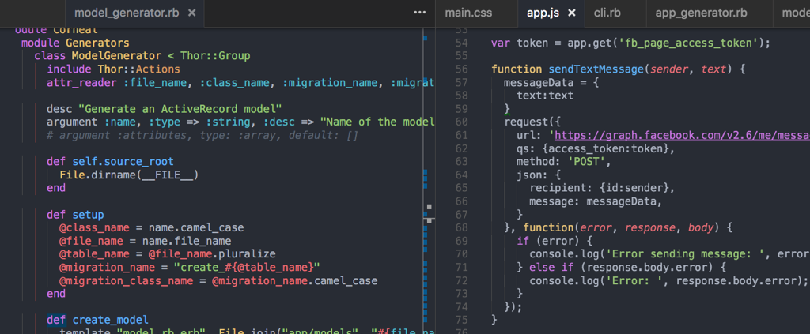

# One Dark Theme
[](https://marketplace.visualstudio.com/items?itemName=azemoh.theme-onedark) [](https://marketplace.visualstudio.com/items?itemName=azemoh.theme-onedark) [](https://marketplace.visualstudio.com/items?itemName=azemoh.theme-onedark)


One dark theme for Visual Studio Code, based on Atom's One Dark

## Install

press `ctl/command + shift + p` to launch the command palette then run
```
ext install theme-onedark
```

## Screenshot
Screenshot of Ruby and JavaScript



Available at [Visual Studio Code Marketplace](https://marketplace.visualstudio.com/items/azemoh.theme-onedark)


## Changelog

#### v 0.2.2

  - Syntax highlight for embeded string.
