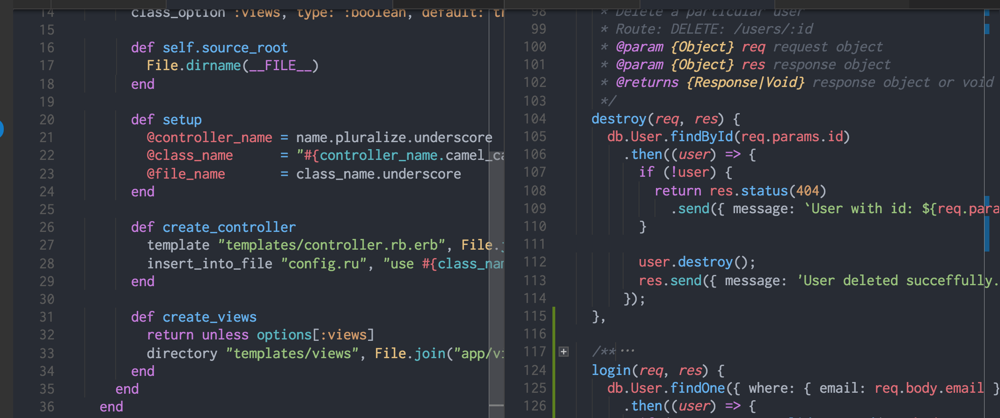

# One Dark Theme

One dark theme for Visual Studio Code, based on Atom's One Dark

[](https://marketplace.visualstudio.com/items?itemName=azemoh.theme-onedark) [](https://marketplace.visualstudio.com/items?itemName=azemoh.theme-onedark) [](https://marketplace.visualstudio.com/items?itemName=azemoh.theme-onedark) [](https://github.com/azemoh/vscode-onedark)


## Install

press `ctl/command + shift + p` to launch the command palette then run
```
ext install theme-onedark
```

## Screenshot
Screenshot of Ruby and JavaScript



If you like this checkout [One Monokai Theme](https://marketplace.visualstudio.com/items?itemName=azemoh.one-monokai)

## Sponsors

<p><a title="Try CodeStream" href="https://sponsorlink.codestream.com/?utm_source=vscmarket&amp;utm_campaign=onedarktheme&amp;utm_medium=banner"></a></br>
Eliminate context switching and costly distractions. Create and merge PRs and perform code reviews from inside your IDE while using jump-to-definition, your favorite keybindings, and other IDE favorites.<br> <a title="Try CodeStream" href="https://sponsorlink.codestream.com/?utm_source=vscmarket&amp;utm_campaign=onedarktheme&amp;utm_medium=banner">Learn more</a></p>


## Changelog
You can take a look at the change log [here](https://github.com/azemoh/vscode-onedark/blob/master/CHANGELOG.md)

[atom-grammer-url]: https://marketplace.visualstudio.com/items?itemName=ms-vscode.js-atom-grammar
