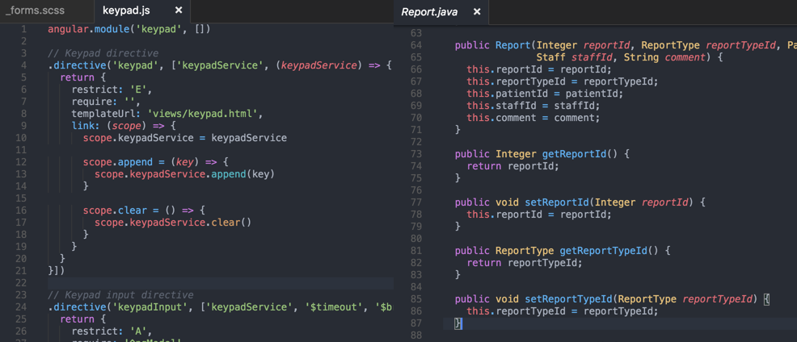

# One Dark Theme

One dark theme for Visual Studio Code, based on Atom's One Dark

[](https://marketplace.visualstudio.com/items?itemName=azemoh.theme-onedark) [](https://marketplace.visualstudio.com/items?itemName=azemoh.theme-onedark) [](https://marketplace.visualstudio.com/items?itemName=azemoh.theme-onedark) [](https://github.com/azemoh/vscode-onedark)


## Install

press `ctl/command + shift + p` to launch the command palette then run
```
ext install theme-onedark
```

## Screenshot
Screenshot of JavaScript and Java (JavaScript with [Atom Grammer][atom-grammer-url] enabled)



If you like this checkout [One Monokai Theme](https://marketplace.visualstudio.com/items?itemName=azemoh.one-monokai)

## Changelog

#### v0.2.x
- Syntax highlight for embeded string.
- Syntax highlight for Logical operators (and, or).
- Syntax highlight for built-in functions.
- Syntax highlight for js "new" keyword.
- Stylesheet string variable.
- Stylesheet functions.
- Fix language variable highlight
- Support for Haml classes and IDs.
- Fix find selection highlight.
- Highlight support variables.
- Improve Java Support

#### v0.3.x
- Improved JavaScript Support - use [Atom JS Grammer][atom-grammer-url] for best result.
- Highlight for JS storege types and entity names.
- Proper Jade string comments


[atom-grammer-url]: https://marketplace.visualstudio.com/items?itemName=ms-vscode.js-atom-grammar
